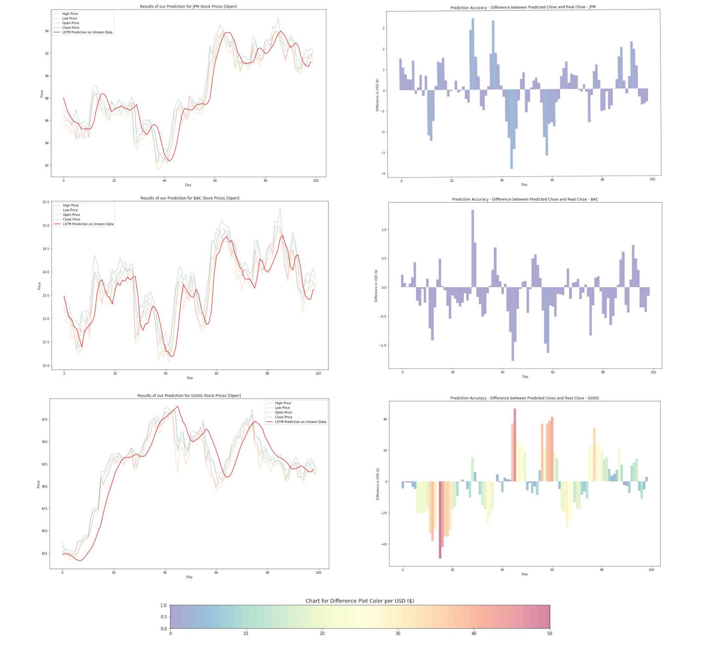

# Deep Market Models

In this repository, we explore the use of univariate long short-term memory neural networks (LSTMs) in conjunction with different trading and hedging algorithms in order to maximize profits over a fixed, short term period. We plan on comparing our algorithms to High Frequency Trading (HFT) algorithms. 

To this point, we have designed and trained a network architecture to predict the close price of different stocks. Some inital results look like we are fitting to the data well without over fitting:

Now that we have saved the .json (topology) and .h5 (weights) for each model, we will continue evaluating the models performance--especically in prediction. With its performance in mind, we will begin to think of suitable trading algorithms. 

We would like to thank the kaggle community, without reading their discussion, we would  - https://www.kaggle.com/dgawlik/nyse

#### Dependencies:
Numpy   
Scipy   
Keras    
Tensorflow (>ver 1.1.0)   
